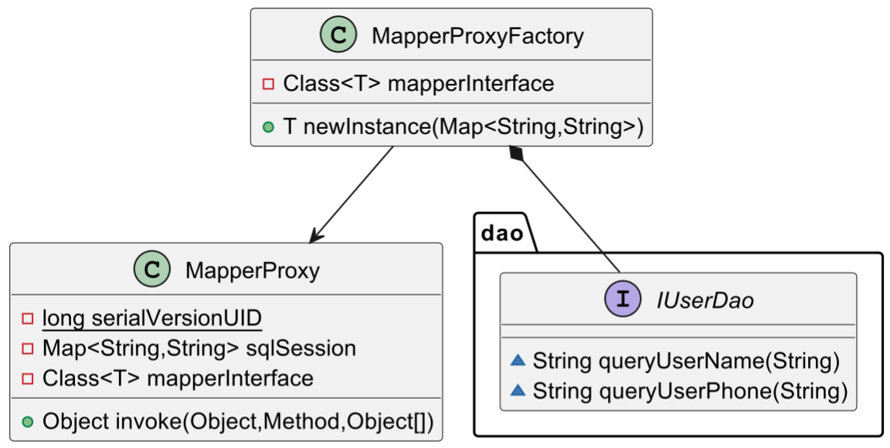

# 映射器代理工厂的设计与实现

## 一、前言

ORM（对象关系映射）框架**通过将数据库表映射到对象模型，从而屏蔽了对数据库操作的细节**，比如MyBatis。它的核心功能实现如下：

1. **关联对象接口和映射类**：
   - **定义对象模型（比如Java类）**，这些对象模型对应数据库中的表结构。每个对象模型对应一个映射类（也称为实体类），用于描述对象模型和数据库表之间的映射关系。
   - **定义DAO（数据访问对象）接口**，该接口定义了对数据库进行CRUD操作的方法。

2. **代理类封装映射操作**：
   - MyBatis通过代理类来包装对DAO接口方法的调用。这些代理类负责将方法调用转发到底层的ORM引擎，ORM引擎再根据映射配置执行相应的数据库操作。
   - 代理类使用动态代理或代码生成技术来在运行时生成实际的DAO实现类的代理对象。这样，我们就无需手动编写DAO的实现类，而是通过简单的配置即可实现数据库操作。

3. **简化配置**：
   - ORM框架提供了简化配置的方式，我们只需在配置文件或注解中指定对象模型和数据库表之间的映射关系，以及其他一些数据库连接参数等信息。
   - 这样，我们就无需手动编写SQL语句，ORM框架会根据配置自动生成SQL语句，并执行数据库操作。

通过上述方式，ORM框架屏蔽了开发者对数据库操作的细节，使得开发者可以更专注于业务逻辑的实现，而无需关注数据库底层的操作。

## 二、本节内容

> MyBatis框架通过代理类将数据库DAO操作接口和映射器链接起来，实现了对数据库操作的封装和管理。

本节先简单通过编写**代理类**来连接数据库DAO操作接口和映射器，代理类负责拦截DAO接口方法的调用，并将其转发给相应的映射器执行数据库操作。简单来说，编写代理类 `MapperProxy` ，通过实现`InvocationHandler`接口来对数据库操作接口的方法进行代理。

同时，我们再做一层封装，将代理类的创建过程封装在工厂类中，使得客户端代码只需通过简单的配置即可获取代理对象，而无需关注创建过程的细节，提高代理的可维护性，需要创建代理对象时只需调用工厂类的方法即可，避免了重复的代码。

> 如果代理对象的创建方式需要修改，只需修改工厂类中的代码即可，不需要修改调用方的代码。

我们来看客户端最终的调用代码：

```java
package org.example;

import org.example.dao.IUserDao;
import java.util.HashMap;
import java.util.Map;

/**
 * 通过创建一个 HashMap 来模拟 Mapper.xml 中的 SQL 语句执行
 * 这个 HashMap 将 IUserDao 中的方法名映射到它们对应的 SQL 操作
 * 然后它使用 MapperProxyFactory 创建一个 IUserDao 的新实例，并测试对应接口方法
 */
public class Main {
    public static void main(String[] args) {
        // 创建一个 IUserDao 的新 MapperProxyFactory
        MapperProxyFactory<IUserDao> factory = new MapperProxyFactory<>(IUserDao.class);

        // 创建一个新的 HashMap 来模拟 Mapper.xml 中的 SQL 语句执行
        Map<String, String> sqlSession = new HashMap<>();

        // 将 IUserDao 中的方法名映射到它们对应的 SQL 操作
        sqlSession.put("org.example.dao.IUserDao.queryUserName", " Mapper.xml 中 SQL 语句 1：查询用户姓名");
        sqlSession.put("org.example.dao.IUserDao.queryUserPhone", " Mapper.xml 中 SQL 语句 2：查询用户电话号码");

        // 使用 MapperProxyFactory 创建一个 IUserDao 的新实例
        IUserDao userDao = factory.newInstance(sqlSession);

        // 用测试用户 ID 调用 queryUserName 方法并打印结果
        String ret1 = userDao.queryUserName("1001");
        String ret2 = userDao.queryUserPhone("1001");
        System.out.println(ret1);
        System.out.println(ret2);
    }
}
```



## 三、代码实现

### （1）数据库操作接口

DAO（数据访问对象），提供了一种标准的方式来访问和操作数据库中的数据，而不用关心具体的数据库实现细节。

```java
package org.example.dao;

/**
 * @description 用户数据库操作接口
 */
public interface IUserDao {

    String queryUserName(String uId);

    String queryUserPhone(String uId);

}
```

### （2）映射器代理类

`MapperProxy`是一个实现了`InvocationHandler`接口的映射器代理类，用于对数据库操作接口的方法进行代理，实现方法的调用。

记录如下：

- **字段**：
  - `sqlSession`：数据库会话信息，存储了映射语句的信息。我们可以理解为SQL语句操作都是通过`接口名称+方法名称作为key`，操作作为逻辑的方式进行使用的。
  - `mapperInterface`：映射器接口类对象，表示被代理的接口。

- **构造函数**：
  - 接受数据库会话信息和映射器接口类对象作为参数，并进行初始化。

- **invoke方法**：
  - 该方法是`InvocationHandler`接口的核心方法，用于对代理对象的方法调用进行处理。
  - 首先检查是否调用的是`Object`类的方法，如果是则直接调用，否则进入代理逻辑。
  - 对于其他方法，根据方法名从`sqlSession`中获取对应的映射语句，并进行执行。如果找不到映射语句，则抛出异常。

```java
package org.example;

import java.io.Serializable;
import java.lang.reflect.InvocationHandler;
import java.lang.reflect.Method;
import java.util.Map;

/**
 * 映射器代理类，实现 InvocationHandler 接口，对数据库操作接口的方法进行代理，实现方法的调用。
 */
public class MapperProxy<T> implements InvocationHandler, Serializable {

    private static final long serialVersionUID = 7526472295622776147L;

    private Map<String, String> sqlSession;

    private final Class<T> mapperInterface;

    public MapperProxy(Map<String, String> sqlSession, Class<T> mapperInterface) {
        this.sqlSession = sqlSession;
        this.mapperInterface = mapperInterface;
    }

    @Override
    public Object invoke(Object proxy, Method method, Object[] args) throws Throwable {
        // 检查是否调用的是 Object 类的方法
        if (Object.class.equals(method.getDeclaringClass())) {
            return method.invoke(this, args);
        } else {
            // 对其他方法进行代理
            String statement = sqlSession.get(mapperInterface.getName() + "." + method.getName());
            if (statement == null) {
                throw new RuntimeException("找不到映射语句：" + mapperInterface.getName() + "." + method.getName());
            }
            return "正在代理中...执行" + statement;
        }
    }
}
```

简单来说，这个代理类的作用是拦截接口方法的调用，根据映射语句执行相应的数据库操作，并返回执行结果。通过这种方式，实现了对数据库操作的透明代理，使得客户端代码无需关心具体的数据库操作细节。

### （3）代理类工厂

`MapperProxyFactory`是一个映射器代理工厂类，用于创建数据库操作接口的代理对象。

记录：

- **字段**：
  - `mapperInterface`：映射器接口类对象，表示需要创建代理对象的接口。

- **构造函数**：
  - 接受映射器接口类对象作为参数，并进行初始化。

- **newInstance方法**：
  - 接受数据库会话信息作为参数，用于创建代理对象。
  - 首先创建了一个`MapperProxy`对象，传入数据库会话信息和映射器接口类对象。
  - 然后调用`Proxy.newProxyInstance`方法创建代理对象，该方法接受一个类加载器、一个接口数组和一个`InvocationHandler`对象作为参数，返回一个实现了指定接口的代理对象。
  - 在这里，类加载器使用映射器接口类对象的类加载器，接口数组包含了映射器接口类对象，而`InvocationHandler`对象则是前面创建的`MapperProxy`对象。

```java
package org.example;

import java.lang.reflect.Proxy;
import java.util.Map;

/**
 * 映射器代理工厂类，用于创建数据库操作接口的代理对象。
 */
public class MapperProxyFactory<T> {

    private final Class<T> mapperInterface;

    public MapperProxyFactory(Class<T> mapperInterface) {
        this.mapperInterface = mapperInterface;
    }

    public T newInstance(Map<String, String> sqlSession) {
        final MapperProxy<T> mapperProxy = new MapperProxy<>(sqlSession, mapperInterface);
        return (T) Proxy.newProxyInstance(mapperInterface.getClassLoader(), new Class[]{mapperInterface}, mapperProxy);
    }
}
```

这个工厂类的作用是封装了代理对象的创建过程，提供了一个统一的方法用于创建数据库操作接口的代理对象。通过这种方式，简化了客户端代码的调用流程，使得使用者只需通过简单的配置即可获取到代理对象，而无需关心代理对象的创建细节。